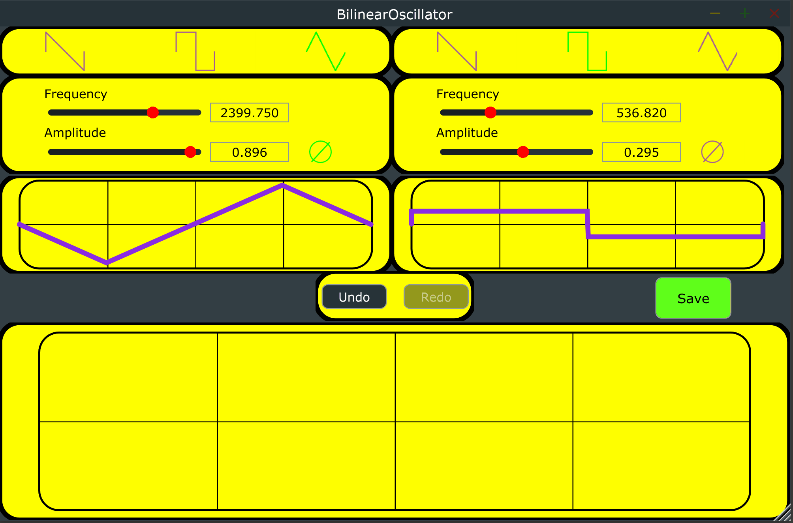

# BilinearOscillator

This application is a Bilinear Audio oscillator made with C++14/[Juce](https://juce.com/).  
It features two oscillators that can morph in a single waveform and a modern and smooth User Interface to be used as building block of a digital audio synthesizer.  
Each oscillator provides controls for Waveform selection (Sawtooth, Square and Triangle), Frequency, Amplitude and Phase Inversion.  
The UI editor provides an Undo/Redo mechanism to facilitate A/B editing.  

